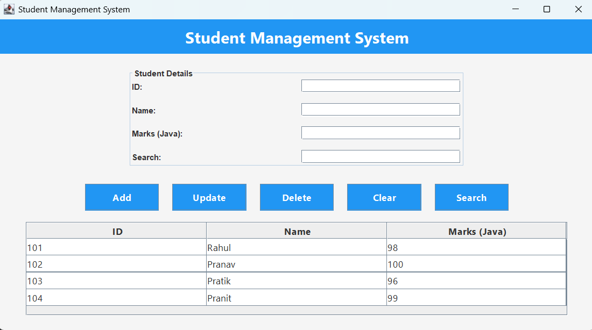

# 🎓 Student Management System (Java Swing)

## 📌 Project Description

The Student Management System is a desktop-based Java application developed using Swing and AWT. It allows users to efficiently manage student records including adding, updating, deleting, and searching student data.

This project demonstrates core concepts of Java such as GUI development, event handling, file handling, and object-oriented programming.

---

## 🚀 Features

* ➕ Add new student records
* 🔍 Search students by ID or Name
* ✏️ Update existing student details
* ❌ Delete student records
* 📋 Display all students in tabular format
* 💾 Data storage using file handling

---

## 🛠️ Technologies Used

* Java (JDK 8+)
* Swing & AWT (GUI)
* File Handling (Text/CSV)
* OOP Concepts

---

## 📂 Project Structure

```
StudentManagementSystem/
│── src/
│   └── StudentManagementSystem.java
│── data/
│   └── students.txt
│── README.md
```

---

## ▶️ How to Run the Project

1. Clone the repository:

   ```
   git clone https://github.com/your-username/Student-Management-System.git
   ```

2. Open in any IDE like IntelliJ IDEA / Eclipse

3. Compile and run:

   ```
   javac StudentManagementSystem.java
   java StudentManagementSystem
   ```

---

## 📸 Screenshots



---

## 💡 Future Enhancements

* Database integration (MySQL)
* Login Authentication System
* Export data to Excel/PDF
* Improved UI/UX design

---

## 👨‍💻 Author

Sanskar Sonawane

---

## 📜 License

This project is for educational purposes.
